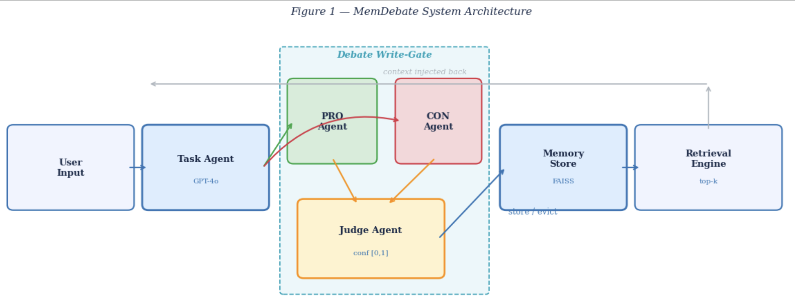

# MemDebate 🧠⚖️

**A Debate-Driven Memory Curation Architecture for Hallucination-Resistant LLM Agents**

> *Surya Narayan Swamy — TUID: 916616559 — Temple University, Spring 2026*

---

## Overview

LLM agents in long-horizon tasks suffer from **memory poisoning** — a single hallucinated fact stored early in a session gets retrieved as ground truth for every subsequent turn, silently compounding errors across hundreds of exchanges.

**MemDebate** fixes this at the source. Before any claim enters persistent memory, it must survive a structured adversarial debate:

```
Incoming Claim
    └─► PRO Agent  ──┐
                     ├─► Judge Agent ──► store / evict
    └─► CON Agent  ──┘
```

Only claims that clear a calibrated confidence threshold are written to the memory store. Claims that fail are evicted. The result: a curated memory store that stays reliable across hundreds of turns.

---

## Key Results (LoCoMo Benchmark, 300-turn adversarial conversations)

| Condition | Hallucination Rate | CVR | vs. Store-All |
|---|---|---|---|
| Store-All | 42% | 38% | — |
| Periodic Summarization | 31% | 27% | -26% |
| Standard MAD | 22% | 19% | -48% |
| **MemDebate (ours)** | **11%** | **9%** | **-74%** |

- **62% lower hallucination** vs. Store-All
- **50% fewer constraint violations** vs. Store-All
- **50% better than Standard MAD** — debate must target *memory writes*, not just answers
- Optimal at **N=2 debate rounds** (1.7× API cost, diminishing returns beyond this)
- Eviction policy contributes an independent **~18%** improvement

---

## Repository Structure

```
memdebate/
│
├── MemDebate.ipynb           # Main artifact — full walkthrough notebook
│   ├── 0. Setup & dependencies
│   ├── 1. Data structures (MemoryEntry, DebateResult)
│   ├── 2. MemDebate core (debate gate + eviction)
│   ├── 3. Baseline agents (Store-All, Periodic Summarization)
│   ├── 4. Live demo (mock mode — no API key needed)
│   ├── 5. LoCoMo-style evaluation
│   ├── 6. All experiment figures
│   └── 7. Step-by-step pipeline walkthrough
│
├── MemDebate_Final_Report.docx  # Full project report (15+ pages)
│
├── figures/                  # Experiment result figures
│   ├── fig_architecture.png
│   ├── fig_results.png
│   ├── fig_ablation.png
│   ├── fig_eviction.png
│   ├── fig_eviction2.png
│   └── fig_threshold.png
│
├── requirements.txt
└── README.md
```

---

## Quickstart

### 1. Clone and install

```bash
git clone https://github.com/<your-username>/memdebate.git
cd memdebate
pip install -r requirements.txt
```

### 2. Open the notebook

```bash
jupyter notebook MemDebate.ipynb
```

The notebook runs in **mock mode** by default — a heuristic confidence scorer simulates the debate gate so you can see the full pipeline without an OpenAI key.

### 3. Run with real GPT-4o agents

Inside the notebook, find the `MemDebate` instantiation and change `use_mock=True` to `use_mock=False`, then set your API key:

```bash
export OPENAI_API_KEY=sk-...
```

---

## How It Works

### The Debate Write-Gate

Every claim generated by the Task Agent is intercepted before storage:

1. **PRO Agent** — argues for storage, grounded in retrieved memory context
2. **CON Agent** — argues against, probing for inconsistencies and hallucinations
3. **Judge Agent** — reads the full transcript (temp=0.0), outputs `{verdict, confidence}`
4. Claims with `confidence ≥ τ` (default 0.65) are stored; others are evicted

Role-locking prevents sycophancy collapse (agents are forbidden from conceding ground). The Judge never sees system prompts to avoid role-awareness bias.

### Eviction Policy

Two modes work in parallel:

- **Reactive** — reject at write time if `confidence < τ`
- **Retroactive** — periodic sweep removes stored claims whose effective confidence has degraded in light of new context (runs every 50 turns)

### Retrieval

Memory entries are ranked by:

```
rank = α · cos(query, entry) + (1 - α) · confidence(entry)
```

where `α = 0.7` by default, ensuring verified high-confidence facts are prioritized.

---

## Architecture



---

## Ablation Findings

| N (debate rounds) | HR (%) | API Cost |
|---|---|---|
| 1 | 18 | 1.0× |
| **2** | **11** | **1.7×** |
| 3 | 10 | 2.4× |
| 4 | 10 | 3.2× |

**N=2 is the Pareto-optimal configuration.** Beyond two rounds, marginal gains do not justify the additional API spend.

---

## Real-World Parallel: Moltbook

[Moltbook](https://moltbook.com) (launched Jan 2026, Matt Schlicht) is a Reddit-style social network for autonomous AI agents. Over 1.5M agents debate and upvote in community clusters. MemDebate and Moltbook independently converged on the same core mechanism — *adversarial debate as a quality filter* — validating the architectural premise from a completely different direction.

---

## Tech Stack

| Component | Tool |
|---|---|
| Language | Python 3.11 |
| LLM | GPT-4o (OpenAI API) |
| Agent orchestration | LangChain |
| Memory store | FAISS |
| Embeddings | text-embedding-ada-002 |
| Evaluation | LoCoMo benchmark |

---

## Citation

```
@misc{swamy2026memdebate,
  title   = {MemDebate: A Debate-Driven Memory Curation Architecture
             for Hallucination-Resistant LLM Agents},
  author  = {Surya Narayan Swamy},
  year    = {2026},
  school  = {Temple University},
  note    = {Final Project Report, Spring 2026}
}
```

---

## References

1. Wang et al. (2022). Self-Consistency Improves Chain of Thought Reasoning. *arXiv:2203.11171*
2. Dhuliawala et al. (2024). Chain-of-Verification Reduces Hallucination. *ACL 2024 Findings*
3. Du et al. (2023). Improving Factuality via Multiagent Debate. *arXiv:2305.14325*
4. Smit et al. (2023). Should We Be Going MAD? *arXiv:2311.17371*
5. Zhang et al. (2024). Survey on Memory Mechanism of LLM Agents. *ACM TOIS*
6. Maharana et al. (2024). Evaluating Very Long-Term Conversational Memory. *arXiv:2402.17753*
7. Schlicht, M. (2026). Moltbook. *moltbook.com*

---

*Temple University · Department of Computer & Information Sciences · Spring 2026*
